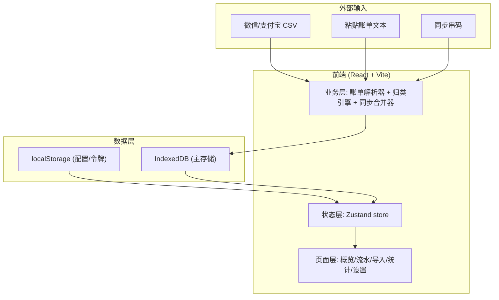
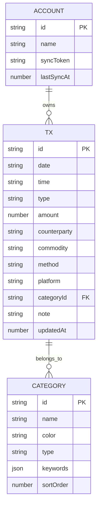

# 账簿 · 技术架构

## 1. 架构设计



纯前端架构，无后端服务。数据持久化于浏览器 IndexedDB；多端同步通过"同步串码"（编码后的变更集）在设备间手动/半自动传递并按时间戳合并。

## 2. 技术说明

- **前端**：React@19 + tailwindcss@3 + vite
- **初始化工具**：vite（复用现有项目）
- **状态管理**：zustand（轻量、无样板）
- **图表**：自研 SVG 组件（环形图、折线、柱状、热力），避免重依赖
- **数据库**：IndexedDB（通过轻封装 idb-keyval 或原生）
- **后端**：无
- **路由**：react-router-dom@6

## 3. 路由定义

| 路由 | 用途 |
|------|------|
| `/` | 概览页：净值卡片、近期流水、月度趋势、月历热力 |
| `/entries` | 流水页：完整交易列表、筛选、快速记账 |
| `/import` | 导入页：账单文本/CSV 识别、预览、批量入库 |
| `/analytics` | 统计页：类目占比、趋势、Top 商户、月度对比 |
| `/settings` | 设置页：类目管理、同步、备份 |

## 4. API 定义

无后端 API。前端内部模块以 ES 模块函数形式提供：

```ts
// 账单解析
parseWeChatText(text: string): ParsedTx[]
parseAlipayText(text: string): ParsedTx[]
parseCSV(file: File, platform: 'wechat' | 'alipay'): Promise<ParsedTx[]>

interface ParsedTx {
  date: string        // ISO yyyy-mm-dd
  time?: string       // HH:mm
  type: 'income' | 'expense'
  amount: number
  counterparty: string
  commodity: string
  method: string      // 支付方式
  rawPlatform: 'wechat' | 'alipay'
  category?: string   // 归类后
}

// 归类引擎
classifyTx(tx: ParsedTx, rules: CategoryRule[]): string

interface CategoryRule {
  id: string
  name: string
  color: string
  keywords: string[]   // 商户/商品关键词
  type: 'income' | 'expense' | 'both'
}

// 数据访问 (IndexedDB)
listTx(): Promise<Tx[]>
addTx(tx: Tx): Promise<void>
bulkAddTx(txs: Tx[]): Promise<void>
updateTx(id: string, patch: Partial<Tx>): Promise<void>
deleteTx(id: string): Promise<void>

// 同步
exportSyncToken(): string
importSyncToken(token: string): void
exportChangesBundle(since: number): string   // base64 编码变更集
mergeChangesBundle(bundle: string): Promise<{added:number, updated:number}>
```

## 5. 服务器架构

无后端，不适用。

## 6. 数据模型

### 6.1 数据模型定义



### 6.2 数据定义语言（IndexedDB Store 等价结构）

```js
// IndexedDB: ledger-db (version 1)
// store: transactions  (keyPath: id, index: date, categoryId, updatedAt)
{
  id: 'tx_<timestamp>_<rand>',
  date: '2026-07-28',
  time: '14:32',
  type: 'expense',          // 'income' | 'expense'
  amount: 38.50,
  counterparty: '美团外卖',
  commodity: '午餐',
  method: '零钱',
  platform: 'wechat',       // 'wechat' | 'alipay' | 'manual'
  categoryId: 'cat_food',
  note: '',
  updatedAt: 1785168588000
}

// store: categories  (keyPath: id)
{
  id: 'cat_food',
  name: '餐饮',
  color: '#9B2C2C',
  type: 'expense',
  keywords: ['美团', '饿了么', '肯德基', '星巴克', '瑞幸', '外卖'],
  sortOrder: 1
}

// store: meta  (keyPath: key)  —— 账户、同步令牌、配置
{ key: 'account', value: { id, name, syncToken, lastSyncAt } }
{ key: 'prefs', value: { theme, currency } }
```

### 6.3 初始类目数据

```js
[
  { id:'cat_food',     name:'餐饮',   color:'#9B2C2C', keywords:['美团','饿了么','肯德基','麦当劳','星巴克','瑞幸','外卖','餐厅'] },
  { id:'cat_transport',name:'交通',   color:'#1C1917', keywords:['滴滴','高德','地铁','公交','12306','携程','打车','出行'] },
  { id:'cat_shopping', name:'购物',   color:'#B8893E', keywords:['淘宝','京东','拼多多','天猫','超市','便利店'] },
  { id:'cat_entertain',name:'娱乐',   color:'#7C3AED', keywords:['电影','猫眼','腾讯视频','爱奇艺','网易云','游戏','Steam'] },
  { id:'cat_housing',  name:'居家',   color:'#2F5D3A', keywords:['水电','燃气','物业','房租','宽带'] },
  { id:'cat_medical',  name:'医疗',   color:'#DC2626', keywords:['医院','药店','诊所','医保','挂号'] },
  { id:'cat_salary',   name:'工资',   color:'#2F5D3A', type:'income', keywords:['工资','薪资','报销','退款','薪酬'] },
  { id:'cat_transfer', name:'转账',   color:'#6B6357', type:'both',   keywords:['转账','红包','收款','AA'] },
]
```
